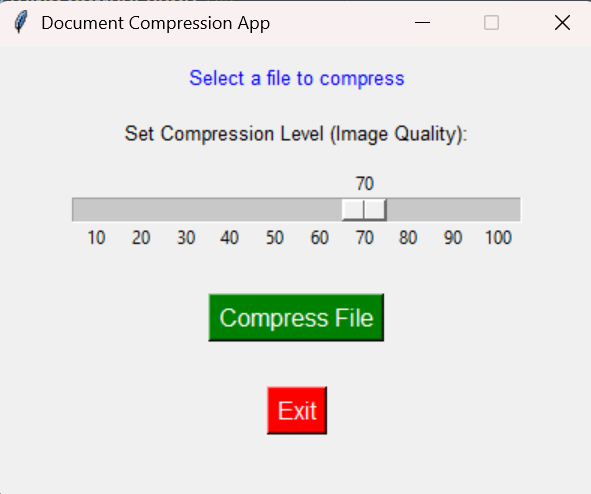

# Document Compression App

This is a simple Python-based desktop application that compresses **PDFs** and **images**. The app features a graphical user interface (GUI) built with **Tkinter** and supports adjustable compression levels for images using a slider.

## Features
- **Compress PDF files** without altering the content.
- **Compress image files** (JPG, PNG) with adjustable quality levels.
- User-friendly GUI for easy interaction.
- Saves compressed files to a specified location.

## Preview


## Requirements
- Python 3.8 or above
- Required Libraries:
  - `pillow`
  - `pypdf2`

## Installation

### 1. Clone the Repository
```bash
git clone https://github.com/Coding-Shanks/Document-Compression-App.git
cd Document-Compression-App
